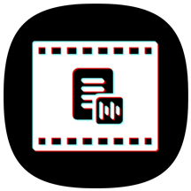

  
    <h3 align="center">AutoTitle</h3>
  

    Android application that using ML for automate video captions extraction
  

This work is designed for <a href="https://honorcup.ru/">Huawei Honor Cup 2020 competition</a>

  

### Built with
- [Huawei ML Kit](https://developer.huawei.com/consumer/en/hms/huawei-mlkit/)
- [Moxy](https://github.com/moxy-community/Moxy)
- Dagger2
- [RxJava3](https://github.com/ReactiveX/RxJava)
- [Mp4Composer-android](https://github.com/MasayukiSuda/Mp4Composer-android)

Test [apk](app/release/app-release.apk) file

## Screenshots

<pre>
   
</pre>

### Inspired by
* [Android Camera](https://github.com/aserbao/AndroidCamera)
* [PhotoEditor](https://github.com/burhanrashid52/PhotoEditor)
